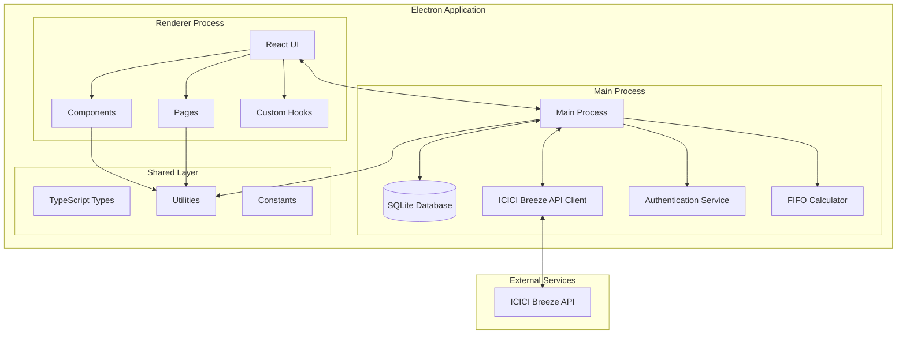

# Design Document

## Overview

The Stock Portfolio Management Software is a desktop application built using Electron, React, and SQLite, designed specifically for Indian retail investors. The application follows a secure, offline-first architecture where all sensitive data remains on the user's local machine, with external API calls limited to real-time price fetching from ICICI Breeze.

The system implements a three-layer architecture:
- **Main Process (Node.js)**: Handles database operations, API integration, authentication, and system-level operations
- **Renderer Process (React)**: Provides the user interface and presentation layer
- **Shared Layer**: Contains common utilities, types, and business logic used by both processes

Key design principles include data privacy (offline-first), accurate financial calculations (FIFO-based), Indian market compliance, and cross-platform compatibility.

## Architecture

### System Architecture



### Process Communication

The application uses Electron's IPC (Inter-Process Communication) for secure communication between the main and renderer processes:

- **Preload Script**: Exposes safe APIs to the renderer process
- **IPC Channels**: Dedicated channels for different operations (auth, portfolio, transactions, reports)
- **Context Isolation**: Renderer process has no direct access to Node.js APIs
- **Security**: All database and API operations happen in the main process

### Data Flow

1. **User Authentication**: Renderer → Main Process → SQLite → Session Management
2. **Portfolio Loading**: Renderer → Main Process → SQLite + Price Cache → Calculations → UI Update
3. **Transaction Management**: Renderer → Main Process → SQLite → FIFO Recalculation → UI Update
4. **Price Updates**: Timer → Main Process → ICICI API → SQLite Cache → Renderer Update
5. **Report Generation**: Renderer → Main Process → SQLite Query → PDF/Excel Generation → File System

## Components and Interfaces

### Main Process Components

#### Database Manager
```typescript
interface DatabaseManager {
  initialize(): Promise<void>;
  executeQuery(sql: string, params: any[]): Promise<any>;
  executeTransaction(queries: QueryBatch[]): Promise<void>;
  backup(filePath: string): Promise<void>;
  restore(filePath: string): Promise<void>;
}
```

#### Authentication Service
```typescript
interface AuthenticationService {
  createUser(username: string, password: string): Promise<boolean>;
  validateUser(username: string, password: string): Promise<boolean>;
  hashPassword(password: string): Promise<string>;
  createSession(userId: number): Promise<string>;
  validateSession(sessionToken: string): Promise<boolean>;
  logout(sessionToken: string): Promise<void>;
}
```

#### ICICI Breeze API Client
```typescript
interface BreezeAPIClient {
  authenticate(apiKey: string, secretKey: string): Promise<boolean>;
  getQuotes(stockTokens: string[]): Promise<StockQuote[]>;
  subscribeToFeeds(stockTokens: string[]): Promise<void>;
  unsubscribeFromFeeds(stockTokens: string[]): Promise<void>;
  isMarketOpen(): boolean;
  getLastUpdateTime(): Date;
}

interface StockQuote {
  stockToken: string;
  symbol: string;
  ltp: number; // Last Traded Price
  change: number;
  changePercent: number;
  volume: number;
  timestamp: Date;
}
```

#### FIFO Calculator
```typescript
interface FIFOCalculator {
  calculateRealizedGains(sellTransaction: Transaction, buyLots: BuyLot[]): RealizedGain;
  calculateUnrealizedGains(holdings: Holding[], currentPrices: Map<string, number>): UnrealizedGain[];
  updatePortfolioAfterTransaction(portfolio: Portfolio, transaction: Transaction): Portfolio;
  getHoldingPeriod(buyDate: Date, sellDate: Date): number;
  classifyGains(holdingPeriod: number, gains: number): GainClassification;
}

interface BuyLot {
  transactionId: number;
  symbol: string;
  quantity: number;
  price: number;
  date: Date;
  remainingQuantity: number;
}

interface RealizedGain {
  transactionId: number;
  symbol: string;
  quantity: number;
  buyPrice: number;
  sellPrice: number;
  buyDate: Date;
  sellDate: Date;
  holdingPeriod: number;
  gainAmount: number;
  gainType: 'STCG' | 'LTCG';
  taxRate: number;
}
```

### Renderer Process Components

#### Portfolio Dashboard
```typescript
interface PortfolioDashboard {
  portfolioSummary: PortfolioSummary;
  holdings: Holding[];
  todaysGainLoss: number;
  overallGainLoss: number;
  totalInvestment: number;
  currentValue: number;
  lastUpdated: Date;
}

interface PortfolioSummary {
  totalStocks: number;
  totalInvestment: number;
  currentValue: number;
  todaysGain: number;
  overallGain: number;
  realizedGains: number;
  unrealizedGains: number;
}
```

#### Transaction Management
```typescript
interface TransactionForm {
  symbol: string;
  transactionType: 'BUY' | 'SELL';
  quantity: number;
  price: number;
  date: Date;
  charges: number;
  validate(): ValidationResult;
  submit(): Promise<boolean>;
}

interface TransactionList {
  transactions: Transaction[];
  filters: TransactionFilters;
  sortBy: SortOption;
  pagination: PaginationInfo;
}
```

#### Report Generator
```typescript
interface ReportGenerator {
  generateCapitalGainsReport(financialYear: string, format: 'PDF' | 'EXCEL' | 'CSV'): Promise<string>;
  generatePortfolioReport(asOfDate: Date, format: 'PDF' | 'EXCEL'): Promise<string>;
  generateTransactionReport(dateRange: DateRange, format: 'CSV' | 'EXCEL'): Promise<string>;
}
```

### IPC Interface Definitions

```typescript
interface IPCChannels {
  // Authentication
  'auth:login': (username: string, password: string) => Promise<AuthResult>;
  'auth:logout': () => Promise<void>;
  'auth:create-user': (username: string, password: string) => Promise<boolean>;
  
  // Portfolio
  'portfolio:get-summary': () => Promise<PortfolioSummary>;
  'portfolio:get-holdings': () => Promise<Holding[]>;
  'portfolio:refresh-prices': () => Promise<void>;
  
  // Transactions
  'transactions:add': (transaction: TransactionInput) => Promise<boolean>;
  'transactions:update': (id: number, transaction: TransactionInput) => Promise<boolean>;
  'transactions:delete': (id: number) => Promise<boolean>;
  'transactions:get-all': (filters?: TransactionFilters) => Promise<Transaction[]>;
  
  // Reports
  'reports:generate-capital-gains': (financialYear: string, format: string) => Promise<string>;
  'reports:generate-portfolio': (asOfDate: Date, format: string) => Promise<string>;
  
  // Settings
  'settings:get-api-config': () => Promise<APIConfig>;
  'settings:save-api-config': (config: APIConfig) => Promise<boolean>;
}
```

## Data Models

### Database Schema

#### Users Table
```sql
CREATE TABLE users (
    id INTEGER PRIMARY KEY AUTOINCREMENT,
    username TEXT UNIQUE NOT NULL,
    password_hash TEXT NOT NULL,
    created_at DATETIME DEFAULT CURRENT_TIMESTAMP,
    last_login DATETIME,
    is_active BOOLEAN DEFAULT 1
);
```

#### Stocks Table
```sql
CREATE TABLE stocks (
    id INTEGER PRIMARY KEY AUTOINCREMENT,
    symbol TEXT UNIQUE NOT NULL,
    company_name TEXT NOT NULL,
    exchange TEXT NOT NULL CHECK (exchange IN ('NSE', 'BSE')),
    sector TEXT,
    industry TEXT,
    stock_token TEXT,
    created_at DATETIME DEFAULT CURRENT_TIMESTAMP,
    updated_at DATETIME DEFAULT CURRENT_TIMESTAMP
);
```

#### Transactions Table
```sql
CREATE TABLE transactions (
    id INTEGER PRIMARY KEY AUTOINCREMENT,
    user_id INTEGER NOT NULL,
    stock_id INTEGER NOT NULL,
    transaction_type TEXT NOT NULL CHECK (transaction_type IN ('BUY', 'SELL')),
    quantity INTEGER NOT NULL CHECK (quantity > 0),
    price DECIMAL(10,2) NOT NULL CHECK (price > 0),
    charges DECIMAL(10,2) DEFAULT 0,
    transaction_date DATE NOT NULL,
    created_at DATETIME DEFAULT CURRENT_TIMESTAMP,
    updated_at DATETIME DEFAULT CURRENT_TIMESTAMP,
    FOREIGN KEY (user_id) REFERENCES users(id),
    FOREIGN KEY (stock_id) REFERENCES stocks(id)
);
```

#### Realized Gains Table
```sql
CREATE TABLE realized_gains (
    id INTEGER PRIMARY KEY AUTOINCREMENT,
    user_id INTEGER NOT NULL,
    sell_transaction_id INTEGER NOT NULL,
    buy_transaction_id INTEGER NOT NULL,
    symbol TEXT NOT NULL,
    quantity INTEGER NOT NULL,
    buy_price DECIMAL(10,2) NOT NULL,
    sell_price DECIMAL(10,2) NOT NULL,
    buy_date DATE NOT NULL,
    sell_date DATE NOT NULL,
    holding_period INTEGER NOT NULL,
    gain_amount DECIMAL(10,2) NOT NULL,
    gain_type TEXT NOT NULL CHECK (gain_type IN ('STCG', 'LTCG')),
    tax_rate DECIMAL(5,2) NOT NULL,
    financial_year TEXT NOT NULL,
    created_at DATETIME DEFAULT CURRENT_TIMESTAMP,
    FOREIGN KEY (user_id) REFERENCES users(id),
    FOREIGN KEY (sell_transaction_id) REFERENCES transactions(id),
    FOREIGN KEY (buy_transaction_id) REFERENCES transactions(id)
);
```

#### Price Cache Table
```sql
CREATE TABLE price_cache (
    id INTEGER PRIMARY KEY AUTOINCREMENT,
    stock_id INTEGER NOT NULL,
    symbol TEXT NOT NULL,
    ltp DECIMAL(10,2) NOT NULL,
    change_amount DECIMAL(10,2),
    change_percent DECIMAL(5,2),
    volume INTEGER,
    timestamp DATETIME NOT NULL,
    created_at DATETIME DEFAULT CURRENT_TIMESTAMP,
    FOREIGN KEY (stock_id) REFERENCES stocks(id)
);
```

#### API Settings Table
```sql
CREATE TABLE api_settings (
    id INTEGER PRIMARY KEY AUTOINCREMENT,
    user_id INTEGER NOT NULL,
    api_key_encrypted TEXT NOT NULL,
    secret_key_encrypted TEXT NOT NULL,
    is_active BOOLEAN DEFAULT 1,
    last_connected DATETIME,
    created_at DATETIME DEFAULT CURRENT_TIMESTAMP,
    updated_at DATETIME DEFAULT CURRENT_TIMESTAMP,
    FOREIGN KEY (user_id) REFERENCES users(id)
);
```

### TypeScript Data Models

```typescript
interface User {
  id: number;
  username: string;
  createdAt: Date;
  lastLogin?: Date;
  isActive: boolean;
}

interface Stock {
  id: number;
  symbol: string;
  companyName: string;
  exchange: 'NSE' | 'BSE';
  sector?: string;
  industry?: string;
  stockToken?: string;
}

interface Transaction {
  id: number;
  userId: number;
  stockId: number;
  symbol: string;
  transactionType: 'BUY' | 'SELL';
  quantity: number;
  price: number;
  charges: number;
  transactionDate: Date;
  createdAt: Date;
  updatedAt: Date;
}

interface Holding {
  stockId: number;
  symbol: string;
  companyName: string;
  totalQuantity: number;
  averageCost: number;
  totalInvestment: number;
  currentPrice: number;
  currentValue: number;
  unrealizedGain: number;
  unrealizedGainPercent: number;
  dayChange: number;
  dayChangePercent: number;
  lastUpdated: Date;
}

interface RealizedGain {
  id: number;
  sellTransactionId: number;
  buyTransactionId: number;
  symbol: string;
  quantity: number;
  buyPrice: number;
  sellPrice: number;
  buyDate: Date;
  sellDate: Date;
  holdingPeriod: number;
  gainAmount: number;
  gainType: 'STCG' | 'LTCG';
  taxRate: number;
  financialYear: string;
}

interface FinancialYearSummary {
  financialYear: string;
  totalSTCG: number;
  totalLTCG: number;
  ltcgExemption: number;
  taxableSTCG: number;
  taxableLTCG: number;
  totalTaxLiability: number;
  transactions: RealizedGain[];
}
```

### FIFO Calculation Algorithm

The FIFO (First In, First Out) calculation engine is the core component for accurate capital gains computation:

```typescript
class FIFOCalculationEngine {
  calculateRealizedGains(sellTransaction: Transaction, availableLots: BuyLot[]): RealizedGain[] {
    const realizedGains: RealizedGain[] = [];
    let remainingSellQuantity = sellTransaction.quantity;
    
    // Sort buy lots by date (oldest first)
    const sortedLots = availableLots.sort((a, b) => a.date.getTime() - b.date.getTime());
    
    for (const lot of sortedLots) {
      if (remainingSellQuantity <= 0) break;
      
      const quantityToSell = Math.min(remainingSellQuantity, lot.remainingQuantity);
      const holdingPeriod = this.calculateHoldingPeriod(lot.date, sellTransaction.transactionDate);
      const gainAmount = (sellTransaction.price - lot.price) * quantityToSell;
      const gainType = holdingPeriod > 365 ? 'LTCG' : 'STCG';
      const taxRate = gainType === 'LTCG' ? 12.5 : 20;
      
      realizedGains.push({
        sellTransactionId: sellTransaction.id,
        buyTransactionId: lot.transactionId,
        symbol: sellTransaction.symbol,
        quantity: quantityToSell,
        buyPrice: lot.price,
        sellPrice: sellTransaction.price,
        buyDate: lot.date,
        sellDate: sellTransaction.transactionDate,
        holdingPeriod,
        gainAmount,
        gainType,
        taxRate,
        financialYear: this.getFinancialYear(sellTransaction.transactionDate)
      });
      
      // Update lot and remaining quantity
      lot.remainingQuantity -= quantityToSell;
      remainingSellQuantity -= quantityToSell;
    }
    
    return realizedGains;
  }
  
  private calculateHoldingPeriod(buyDate: Date, sellDate: Date): number {
    const diffTime = sellDate.getTime() - buyDate.getTime();
    return Math.floor(diffTime / (1000 * 60 * 60 * 24));
  }
  
  private getFinancialYear(date: Date): string {
    const year = date.getFullYear();
    const month = date.getMonth();
    return month >= 3 ? `FY ${year}-${year + 1}` : `FY ${year - 1}-${year}`;
  }
}
```

### Indian Market Formatting Utilities

```typescript
class IndianFormatting {
  static formatCurrency(amount: number): string {
    return new Intl.NumberFormat('en-IN', {
      style: 'currency',
      currency: 'INR',
      minimumFractionDigits: 2
    }).format(amount);
  }
  
  static formatNumber(num: number): string {
    if (num >= 10000000) { // 1 crore
      return `${(num / 10000000).toFixed(2)} Cr`;
    } else if (num >= 100000) { // 1 lakh
      return `${(num / 100000).toFixed(2)} L`;
    }
    return new Intl.NumberFormat('en-IN').format(num);
  }
  
  static formatDate(date: Date): string {
    return date.toLocaleDateString('en-IN', {
      day: '2-digit',
      month: 'short',
      year: 'numeric'
    });
  }
  
  static formatPercent(value: number): string {
    return `${value >= 0 ? '+' : ''}${value.toFixed(2)}%`;
  }
}
```

## Correctness Properties

*A property is a characteristic or behavior that should hold true across all valid executions of a system—essentially, a formal statement about what the system should do. Properties serve as the bridge between human-readable specifications and machine-verifiable correctness guarantees.*

### Property 1: Authentication Security Consistency
*For any* user credentials (username, password), the authentication system should hash passwords using bcrypt with cost factor 10, create sessions only for valid credentials, and reject invalid credentials consistently.
**Validates: Requirements 1.1, 1.2, 1.3**

### Property 2: Session Management Integrity  
*For any* user session, if the session remains inactive for 30 minutes, it should be automatically invalidated and require re-authentication.
**Validates: Requirements 1.4**

### Property 3: Data Encryption Consistency
*For any* sensitive data (API credentials, passwords), the system should encrypt the data before storage and be able to decrypt it back to the original value.
**Validates: Requirements 1.5, 7.7, 8.6**

### Property 4: Indian Formatting Consistency
*For any* monetary value, number, or date displayed in the system, it should follow Indian formatting conventions (₹1,23,456.78 for currency, lakhs/crores for large numbers, DD-MMM-YYYY for dates).
**Validates: Requirements 2.5, 2.7, 3.7**

### Property 5: Real-time Price Update Propagation
*For any* price update received from the API, all dependent portfolio calculations (current value, unrealized gains, day changes) should be updated immediately and consistently.
**Validates: Requirements 2.3, 4.7**

### Property 6: API Resilience and Caching
*For any* API failure or unavailability, the system should continue operating using cached price data and implement appropriate retry mechanisms with exponential backoff.
**Validates: Requirements 2.4, 7.3, 7.4, 7.5**

### Property 7: Color Coding Consistency
*For any* gain or loss value displayed in the interface, positive values should be colored green and negative values should be colored red consistently across all components.
**Validates: Requirements 2.6**

### Property 8: Transaction Validation Completeness
*For any* transaction input, the system should validate all required fields (stock, date, type, quantity, price) and reject transactions with missing fields, future dates, or quantities exceeding available holdings.
**Validates: Requirements 3.1, 3.2, 3.3**

### Property 9: Transaction Modification Consistency
*For any* transaction modification, all dependent capital gains calculations should be recalculated to maintain data consistency across the portfolio.
**Validates: Requirements 3.5**

### Property 10: FIFO Calculation Correctness
*For any* sell transaction with multiple available buy lots, the FIFO calculator should consume the oldest buy lots first, maintaining chronological order and accurate cost basis calculation.
**Validates: Requirements 4.1, 4.5**

### Property 11: Holding Period Classification Accuracy
*For any* realized gain calculation, the system should correctly classify gains as STCG (≤365 days, 20% tax) or LTCG (>365 days, 12.5% tax) based on the actual holding period between buy and sell dates.
**Validates: Requirements 4.2, 4.3, 4.4**

### Property 12: Realized Gains Record Integrity
*For any* sell transaction, the system should create complete realized gains records with all transaction details, holding periods, and tax classifications.
**Validates: Requirements 4.6**

### Property 13: Stock Master Data Integrity
*For any* stock in the system, all required information (symbol, name, sector, exchange) should be stored and maintained independently of transactions, with updates propagating to all related records.
**Validates: Requirements 5.1, 5.2, 5.5, 5.6**

### Property 14: Duplicate Prevention Consistency
*For any* attempt to add duplicate stock symbols, the system should prevent creation and return the existing record instead.
**Validates: Requirements 5.4**

### Property 15: Financial Year Calculation Accuracy
*For any* date, the system should correctly determine the financial year (April 1 to March 31) and include only transactions within the specified period when generating reports.
**Validates: Requirements 6.1**

### Property 16: LTCG Exemption Application
*For any* financial year's LTCG calculations, the system should correctly apply the ₹1 lakh exemption limit and separate STCG from LTCG in all reports.
**Validates: Requirements 6.3, 6.4**

### Property 17: Report Completeness
*For any* generated report, it should include all required transaction details (dates, quantities, prices, calculated gains) and handle empty periods with appropriate messages.
**Validates: Requirements 6.6, 6.7**

### Property 18: API Credential Validation
*For any* API credential configuration, the system should validate the connection before saving and encrypt credentials securely.
**Validates: Requirements 7.1**

### Property 19: Market Hours Adaptive Behavior
*For any* time period, the system should adjust API refresh frequency based on market hours (every 30 seconds during market hours, hourly when closed).
**Validates: Requirements 2.2, 7.6**

### Property 20: Database Initialization Consistency
*For any* application startup, if the database schema doesn't exist, it should be created correctly in the user's application data directory using SQLite format.
**Validates: Requirements 8.1, 8.2**

### Property 21: Database Transaction Integrity
*For any* database operation, ACID compliance should be maintained, supporting concurrent reads while preserving data integrity.
**Validates: Requirements 8.4, 8.7**

### Property 22: Backup and Restore Round-trip
*For any* database state, creating a backup and then restoring it should result in an identical database state with all data preserved.
**Validates: Requirements 8.5**

## Error Handling

### Authentication Errors
- **Invalid Credentials**: Display clear error messages without revealing whether username or password is incorrect
- **Session Timeout**: Automatically redirect to login with session expiry notification
- **Account Lockout**: Implement progressive delays for repeated failed login attempts

### API Integration Errors
- **Connection Failures**: Fall back to cached data with clear indication of last update time
- **Rate Limiting**: Implement exponential backoff with maximum retry limits
- **Invalid Responses**: Log errors and continue with existing data, notify user of data staleness
- **Authentication Failures**: Prompt user to re-enter API credentials with validation

### Transaction Processing Errors
- **Validation Failures**: Provide specific field-level error messages with correction guidance
- **Insufficient Holdings**: Prevent overselling with clear available quantity display
- **Date Conflicts**: Reject future dates and transactions before existing holdings
- **Calculation Errors**: Log detailed error information and prevent data corruption

### Database Errors
- **Connection Issues**: Retry with exponential backoff, display user-friendly error messages
- **Constraint Violations**: Provide meaningful error messages for duplicate entries or invalid references
- **Corruption Detection**: Implement database integrity checks with repair/restore options
- **Migration Failures**: Rollback to previous schema version with data preservation

### File System Errors
- **Permission Issues**: Guide user to grant necessary permissions or choose alternative locations
- **Disk Space**: Check available space before large operations like backups or report generation
- **File Locks**: Handle concurrent access gracefully with appropriate user feedback

### Report Generation Errors
- **Large Dataset Handling**: Implement pagination or chunking for large reports
- **Format Errors**: Validate export format compatibility and provide fallback options
- **Template Issues**: Use default templates if custom templates are corrupted or missing

## Testing Strategy

### Dual Testing Approach

The application requires both unit testing and property-based testing for comprehensive coverage:

**Unit Tests** focus on:
- Specific examples and edge cases
- Integration points between components
- Error conditions and boundary cases
- UI component behavior and user interactions

**Property-Based Tests** focus on:
- Universal properties that hold for all inputs
- Comprehensive input coverage through randomization
- Financial calculation correctness across all scenarios
- Data integrity and consistency properties

### Property-Based Testing Configuration

**Testing Framework**: Use `fast-check` library for JavaScript/TypeScript property-based testing
**Test Configuration**: Minimum 100 iterations per property test to ensure comprehensive coverage
**Test Tagging**: Each property test must reference its design document property using the format:
`// Feature: portfolio-manager, Property {number}: {property_text}`

### Critical Testing Areas

**FIFO Calculation Engine**:
- Property tests for all FIFO scenarios with random buy/sell combinations
- Unit tests for specific edge cases (same-day transactions, partial sells)
- Round-trip properties for serialization/deserialization of calculation results

**Authentication and Security**:
- Property tests for password hashing consistency and session management
- Unit tests for specific attack scenarios and edge cases
- Encryption round-trip properties for all sensitive data

**Indian Market Compliance**:
- Property tests for financial year calculations across all date ranges
- Unit tests for specific tax scenarios and exemption applications
- Formatting properties for all monetary and date displays

**Database Operations**:
- Property tests for ACID compliance and concurrent access
- Unit tests for migration scenarios and error recovery
- Backup/restore round-trip properties

**API Integration**:
- Property tests for error handling and retry mechanisms
- Unit tests for specific API response scenarios
- Mock testing for offline functionality

### Test Data Management

**Fixtures**: Comprehensive test datasets covering various portfolio scenarios
**Generators**: Custom generators for Indian stock symbols, financial years, and market data
**Mocking**: Mock ICICI Breeze API responses for consistent testing
**Database**: Separate test database instances for isolation

### Performance Testing

While property-based tests focus on correctness, performance requirements are validated through:
- Load testing with large portfolios (100 stocks, 10,000 transactions)
- Memory usage monitoring during extended operations
- API response time measurement under various network conditions
- Report generation benchmarks with different data sizes

### Integration Testing

**End-to-End Workflows**:
- Complete user journeys from login to report generation
- Cross-platform functionality verification
- Database migration and upgrade scenarios
- Backup/restore complete workflows

**Component Integration**:
- Main process and renderer process communication
- Database and calculation engine integration
- API client and caching layer interaction
- Report generation with all export formats